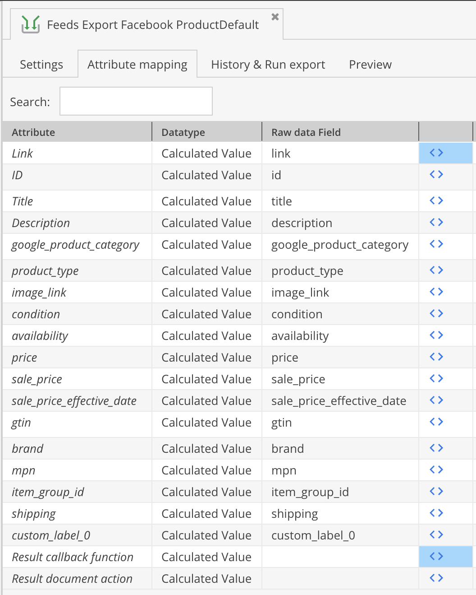

# Facebook Export Add-on for Pimcore Data Director

This bundle adds result callback functions to Data Director's attribute mapping to create an export feed for Facebook. 



## Installation
To use this plugin you have to first buy and install [Pimcore Data Director](https://pimcore.com/en/developers/marketplace/blackbit_digital_commerce/pimcore-data-director_e103850).

Please contact us to get access to the bundle's [Bitbucket repository](https://bitbucket.org/blackbitwerbung/pimcore-plugins-data-director-facebook) or you get the plugin code as a zip file. 
When we allow your account to access our repository, please add the repository to the `composer.json` in your Pimcore root folder (see https://getcomposer.org/doc/05-repositories.md#vcs):
```json
"repositories": [
    {
        "type": "vcs",
        "url": "https://bitbucket.org/blackbitwerbung/pimcore-plugins-data-director-facebook"
    }
],
```

Alternatively if you received the plugin code as zip file, please upload the zip file to your server (e.g. to the Pimcore root folder) and add the following to your `composer.json`:
```json
"repositories": [
    {
        "type": "artifact",
        "url": "path/to/directory/with/zip-file/"
    }
]
```

Then you should be able to execute `composer require blackbit/data-director-facebook` (or `composer update blackbit/data-director-facebook --with-dependencies` for updates if you already have this bundle installed) from CLI.

You can always access the latest version by executing `composer update blackbit/data-director-facebook` on CLI.

## Setup export

Select `Facebook Commerce Feed` from the list of templates for the `Result Callback function` in data director's attribute mapping.

Then the fields which the Facebook feed supports will appear as *virtual* fields in attribute mapping. To those fields you can map your data object class fields via drag & drop (and additional callback functions if necessary). Afterwards you can access the export either via manual import or by a URL (via Data Director's REST API).

## How to get the plugin

Please write an email to [info@blackbit.de](mailto:info@blackbit.de).